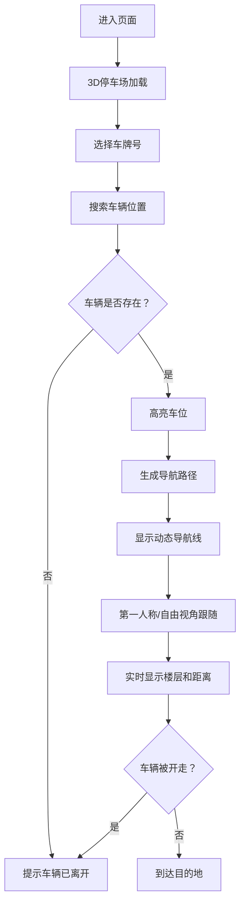
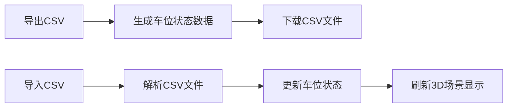

## 1. 产品概述

基于Three.js的3D多层立体停车场自动寻车系统，用户可通过输入车牌号快速定位车辆位置，并在3D场景中获得动态导航引导。系统支持车位状态实时模拟、反向寻车历史记录以及CSV数据导入导出功能。

- **主要用途**：帮助用户在大型多层停车场中快速找到自己的车辆
- **目标用户**：停车场访客、车主、停车场管理人员
- **产品价值**：提升寻车效率，改善停车体验，提供可视化的停车场管理工具

## 2. 核心功能

### 2.1 功能模块

1. **3D停车场场景**：多层立体停车场3D模型展示，支持自由浏览
2. **车牌搜索与定位**：从预设车牌中选择，高亮显示车辆位置
3. **动态导航系统**：从入口到车位的动态导航路径，支持第一人称跟随
4. **实时车位模拟**：随机模拟车辆进出，车位状态实时更新
5. **反向寻车历史**：记录最近查询的车牌及位置，支持快速回溯
6. **CSV数据管理**：支持车位占用状态的批量导入导出

### 2.2 页面详情

| 页面名称 | 模块名称 | 功能描述 |
|---------|---------|----------|
| 主页面 | 3D场景模块 | Three.js渲染的多层停车场，支持鼠标/键盘交互 |
| 主页面 | 车牌选择面板 | 预设10个车牌的下拉选择，寻车按钮 |
| 主页面 | 导航HUD | 显示当前楼层、剩余距离、导航状态 |
| 主页面 | 历史记录面板 | 最近5个查询记录，支持一键重查 |
| 主页面 | 控制面板 | 相机模式切换、CSV导入导出、实时模拟开关 |
| 主页面 | 提示系统 | 车辆离开提示、操作反馈弹窗 |

## 3. 核心流程

### 3.1 寻车主流程
用户进入页面 → 选择车牌号 → 系统定位车辆 → 绘制导航路径 → 用户跟随导航 → 到达车辆位置

### 3.2 流程图

### 3.3 CSV导入导出流程

## 4. 用户界面设计

### 4.1 设计风格
- **整体风格**：科技感深色主题，赛博朋克风格的霓虹光效
- **主色调**：深蓝色背景 (#0a0e1a)，青色主色 (#00f5ff)，橙色强调 (#ff6b35)
- **辅助色**：绿色表示空闲 (#00ff88)，红色表示占用 (#ff4757)
- **按钮风格**：圆角矩形，霓虹发光边框，悬停时亮度增强
- **字体**：现代无衬线字体 (Orbitron + Inter)，科技感数字字体
- **布局风格**：浮动面板式布局，半透明玻璃拟态效果
- **图标风格**：线性简约图标，霓虹色彩填充

### 4.2 页面设计概述

| 页面名称 | 模块名称 | UI元素 |
|---------|---------|-------|
| 主页面 | 3D场景 | 全窗口Three.js画布，环境光+点光源，阴影效果 |
| 主页面 | 车牌选择 | 下拉选择框，发光搜索按钮，车牌样式展示 |
| 主页面 | 导航HUD | 左上角楼层指示器，底部距离进度条，动态箭头 |
| 主页面 | 历史记录 | 右侧可折叠面板，卡片式记录列表 |
| 主页面 | 控制面板 | 底部工具栏，图标按钮组 |
| 主页面 | 提示弹窗 | 居中模态框，渐变背景，动画过渡 |

### 4.3 响应式
- 桌面端优先设计，支持全屏沉浸体验
- 平板设备自适应缩放UI元素
- 移动设备简化交互，保留核心寻车功能
- 触控操作优化：双击缩放、滑动旋转

### 4.4 3D场景设计
- **环境**：室内停车场环境，顶部嵌入式灯光，地面反光材质
- **光照**：多盏点光源模拟停车场灯光，柔和阴影
- **相机**：默认俯视透视视角，可切换第一人称模式
- **构图**：停车场居中展示，预留足够空间浏览
- **交互**：鼠标拖拽旋转、滚轮缩放、键盘WASD移动
- **动画**：导航线流动动画、车位高亮脉冲、车辆模型微动效
- **后处理**：轻微辉光效果增强科技感，色彩分级
- **性能**：优化几何体面数，使用实例化渲染，目标60fps
