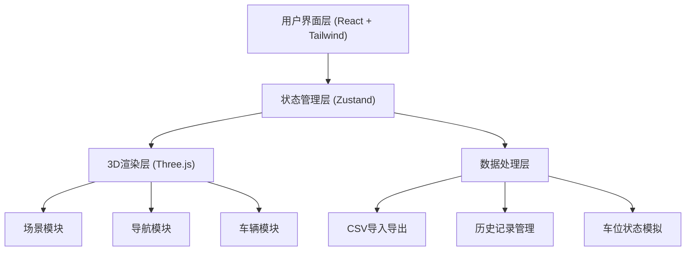

## 1. 架构设计



## 2. 技术描述

- **前端框架**：React@18 + TypeScript
- **构建工具**：Vite@5
- **样式方案**：TailwindCSS@3
- **状态管理**：Zustand@4
- **3D引擎**：Three.js@0.160
- **图标库**：Lucide React
- **后端**：无 (纯前端应用)
- **数据存储**：LocalStorage (历史记录)

### 2.1 技术选型说明
- **Three.js**：原生Three.js而非@react-three/fiber，以便更精细地控制3D场景和动画
- **Zustand**：轻量级状态管理，适合管理3D场景状态和UI状态
- **纯前端**：所有功能在浏览器端实现，无需后端服务

## 3. 页面路由

| 路由 | 用途 |
|-----|------|
| / | 主页面 - 3D停车场寻车系统 |

单页应用，所有功能在主页面内完成。

## 4. 核心模块设计

### 4.1 停车场3D模型模块
- **楼层数量**：3层 (B1, B2, B3)
- **每层车位**：20个 (5行4列)
- **车位尺寸**：2.5m × 5m
- **楼层高度**：3m
- **坡道连接**：每层之间通过螺旋坡道连接

### 4.2 车牌数据 (预设10个)
```
京A12345, 京B67890, 沪C11111, 粤D22222, 川E33333,
浙F44444, 苏G55555, 鲁H66666, 冀J77777, 豫K88888
```

### 4.3 导航路径模块
- 使用Three.js CatmullRomCurve3 创建平滑曲线路径
- 路径点包括：入口 → 坡道 → 目标楼层 → 目标车位
- 动态导航线使用纹理流动动画实现

### 4.4 相机控制
- **自由模式**：OrbitControls 轨道控制器
- **第一人称**：自定义第一人称控制器，WASD移动，鼠标转向

## 5. 数据模型

### 5.1 车位数据结构
```typescript
interface ParkingSpot {
  id: string;
  floor: number; // 0, 1, 2
  row: number;
  col: number;
  position: { x: number; y: number; z: number };
  isOccupied: boolean;
  plateNumber?: string;
  vehicleType?: 'car' | 'suv' | 'none';
}
```

### 5.2 历史记录数据结构
```typescript
interface SearchHistoryItem {
  plateNumber: string;
  timestamp: number;
  floor: number;
  spotId: string;
  position: { x: number; y: number; z: number };
}
```

### 5.3 导航状态数据结构
```typescript
interface NavigationState {
  isActive: boolean;
  targetSpotId: string | null;
  plateNumber: string | null;
  currentFloor: number;
  distanceRemaining: number;
  totalDistance: number;
  pathPoints: Array<{ x: number; y: number; z: number }>;
}
```

## 6. 目录结构

```
src/
├── components/          # React组件
│   ├── ParkingScene.tsx    # 3D场景容器
│   ├── PlateSelector.tsx   # 车牌选择器
│   ├── NavigationHUD.tsx   # 导航HUD
│   ├── HistoryPanel.tsx    # 历史记录面板
│   ├── ControlPanel.tsx    # 控制面板
│   └── Toast.tsx           # 提示弹窗
├── hooks/               # 自定义Hooks
│   ├── useParkingScene.ts  # 3D场景管理Hook
│   ├── useNavigation.ts    # 导航逻辑Hook
│   └── useParkingSim.ts    # 车位模拟Hook
├── store/               # Zustand状态
│   └── parkingStore.ts     # 停车场状态管理
├── utils/               # 工具函数
│   ├── csvUtils.ts         # CSV导入导出
│   ├── pathUtils.ts        # 路径计算
│   └── parkingData.ts      # 预设数据
├── types/               # 类型定义
│   └── parking.ts
├── App.tsx
├── main.tsx
└── index.css
```

## 7. 性能优化策略

1. **3D渲染优化**
   - 使用InstancedMesh渲染重复的车位和车辆
   - 合理设置相机视锥体剔除
   - 阴影贴图尺寸优化

2. **动画优化**
   - 使用requestAnimationFrame统一动画循环
   - 导航线使用ShaderMaterial实现流动效果
   - 状态变更时才触发3D场景更新

3. **内存管理**
   - 及时销毁Three.js对象
   - 历史记录限制为5条
   - 场景资源复用
